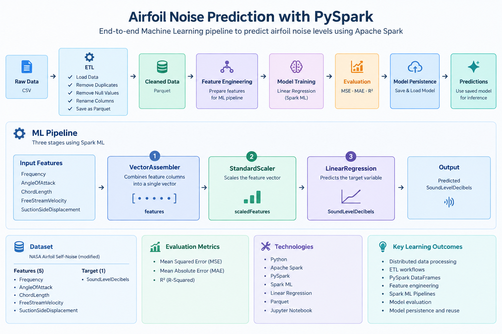

# Airfoil Noise Prediction with PySpark




## Overview

This project builds an end-to-end Machine Learning pipeline using **Apache Spark and PySpark** to predict the noise level generated by an airfoil.

The project uses a modified version of the **NASA Airfoil Self-Noise dataset** and demonstrates the complete workflow from data preparation and ETL to model training, evaluation, and model persistence.

## Project Objectives

- Load and clean the airfoil noise dataset
- Remove duplicate records
- Handle missing values
- Store the cleaned dataset in Parquet format
- Build a Machine Learning pipeline using PySpark
- Train a Linear Regression model
- Evaluate the model using regression metrics
- Save and reload the trained model
- Generate predictions using the persisted model

## Dataset

The project uses a modified version of the NASA Airfoil Self-Noise dataset.

The dataset contains measurements related to airfoil characteristics and acoustic performance.

### Features

- `Frequency`
- `AngleOfAttack`
- `ChordLength`
- `FreeStreamVelocity`
- `SuctionSideDisplacement`

### Target

- `SoundLevelDecibels`

## Technologies

- Python
- Apache Spark
- PySpark
- Spark ML
- Linear Regression
- Parquet
- Jupyter Notebook

## Machine Learning Pipeline

The project uses a three-stage Spark ML pipeline:

```text
Input Features
      ↓
VectorAssembler
      ↓
features
      ↓
StandardScaler
      ↓
scaledFeatures
      ↓
LinearRegression
      ↓
SoundLevelDecibels
